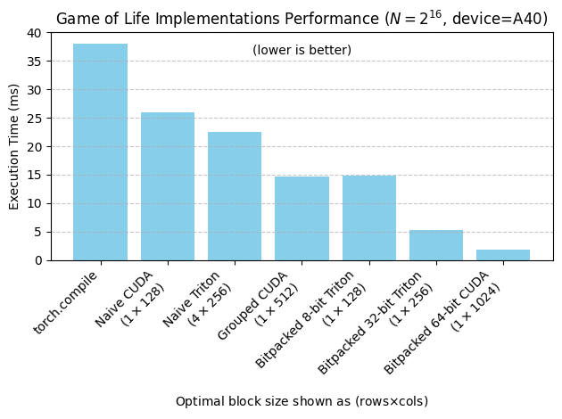

# Conway's Game of Life in CUDA and Triton

This is code accompanying https://www.boristhebrave.com/2025/09/11/accelerated-game-of-life-with-cuda-triton/

I try some variants in pytorch and triton, then benchmark the performance differences.



Note that several of the implementations don't handle the boundary correctly. This could be fixed with more careful loops and masking, or you can just have a simpler kernel to do the boundary separately, as it's a negligable part of the cost.

# Usage

```
uv sync
```

```
uv run pytest
```

`main.py` can be run in interactive mode for various benchmarking and charting features.


# License

CC0